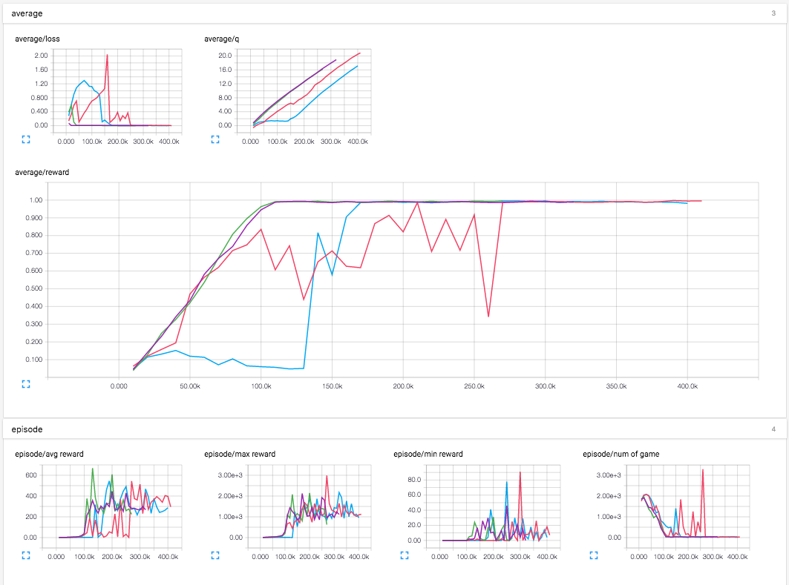
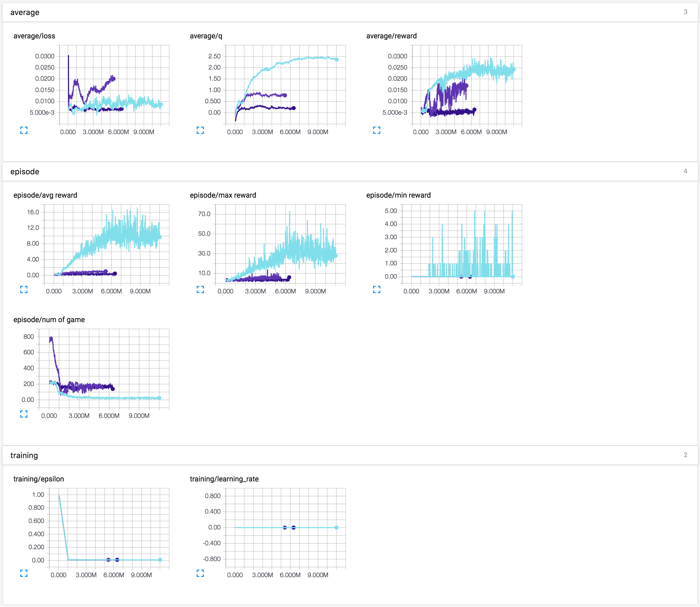

# Deep Reinforcement Learning in TensorFlow

TensorFlow implementation of Deep Reinforcement Learning papers. This implementation contains:

[1] [Playing Atari with Deep Reinforcement Learning](http://arxiv.org/abs/1312.5602)  
[2] [Human-Level Control through Deep Reinforcement Learning](http://home.uchicago.edu/~arij/journalclub/papers/2015_Mnih_et_al.pdf)  
[3] [Deep Reinforcement Learning with Double Q-learning](http://arxiv.org/abs/1509.06461)  
[4] [Dueling Network Architectures for Deep Reinforcement Learning](http://arxiv.org/abs/1511.06581)  
[5] [Prioritized Experience Replay](http://arxiv.org/pdf/1511.05952v3.pdf) (in progress)  
[6] [Deep Exploration via Bootstrapped DQN](http://arxiv.org/abs/1602.04621) (in progress)  
[7] [Asynchronous Methods for Deep Reinforcement Learning](http://arxiv.org/abs/1602.01783) (in progress)  
[8] [Continuous Deep q-Learning with Model-based Acceleration](http://arxiv.org/abs/1603.00748) (in progress)  

## Requirements

- Python 2.7
- [gym](https://github.com/openai/gym)
- [tqdm](https://github.com/tqdm/tqdm)
- [OpenCV2](http://opencv.org/) or [Scipy](https://www.scipy.org/)
- [TensorFlow 0.12.0](https://www.tensorflow.org/)

## Usage

First, install prerequisites with:

    $ pip install -U 'gym[all]' tqdm scipy

Don't forget to also install the latest
[TensorFlow](https://www.tensorflow.org/). Also note that you need to install
the dependences of [`doom-py`](https://github.com/openai/doom-py) which is
required by `gym[all]`

Train with DQN model described in [[1]](#deep-reinforcement-learning-in-tensorflow) without gpu:

    $ python main.py --network_header_type=nips --env_name=Breakout-v0 --use_gpu=False

Train with DQN model described in [[2]](#deep-reinforcement-learning-in-tensorflow):

    $ python main.py --network_header_type=nature --env_name=Breakout-v0

Train with Double DQN model described in [[3]](#deep-reinforcement-learning-in-tensorflow):

    $ python main.py --double_q=True --env_name=Breakout-v0

Train with Deuling network with Double Q-learning described in [[4]](#deep-reinforcement-learning-in-tensorflow):

    $ python main.py --double_q=True --network_output_type=dueling --env_name=Breakout-v0

Train with MLP model described in [[4]](#deep-reinforcement-learning-in-tensorflow) with corridor environment (useful for debugging):

    $ python main.py --network_header_type=mlp --network_output_type=normal --observation_dims='[16]' --env_name=CorridorSmall-v5 --t_learn_start=0.1 --learning_rate_decay_step=0.1 --history_length=1 --n_action_repeat=1 --t_ep_end=10 --display=True --learning_rate=0.025 --learning_rate_minimum=0.0025
    $ python main.py --network_header_type=mlp --network_output_type=normal --double_q=True --observation_dims='[16]' --env_name=CorridorSmall-v5 --t_learn_start=0.1 --learning_rate_decay_step=0.1 --history_length=1 --n_action_repeat=1 --t_ep_end=10 --display=True --learning_rate=0.025 --learning_rate_minimum=0.0025
    $ python main.py --network_header_type=mlp --network_output_type=dueling --observation_dims='[16]' --env_name=CorridorSmall-v5 --t_learn_start=0.1 --learning_rate_decay_step=0.1 --history_length=1 --n_action_repeat=1 --t_ep_end=10 --display=True --learning_rate=0.025 --learning_rate_minimum=0.0025
    $ python main.py --network_header_type=mlp --network_output_type=dueling --double_q=True --observation_dims='[16]' --env_name=CorridorSmall-v5 --t_learn_start=0.1 --learning_rate_decay_step=0.1 --history_length=1 --n_action_repeat=1 --t_ep_end=10 --display=True --learning_rate=0.025 --learning_rate_minimum=0.0025

## Results

Result of `Corridor-v5` in [[4]](#deep-reinforcement-learning-in-tensorflow) for DQN (purple), DDQN (red), Dueling DQN (green), Dueling DDQN (blue).

Result of `Breakout-v0' for DQN without frame-skip (white-blue), DQN with frame-skip (light purple), Dueling DDQN (dark blue).

The hyperparameters and gradient clipping are not implemented as it is as [[4]](#deep-reinforcement-learning-in-tensorflow).

## References

- [DQN-tensorflow](https://github.com/devsisters/DQN-tensorflow)
- [DeepMind's code](https://sites.google.com/a/deepmind.com/dqn/)

## Author

Taehoon Kim / [@carpedm20](http://carpedm20.github.io/)
